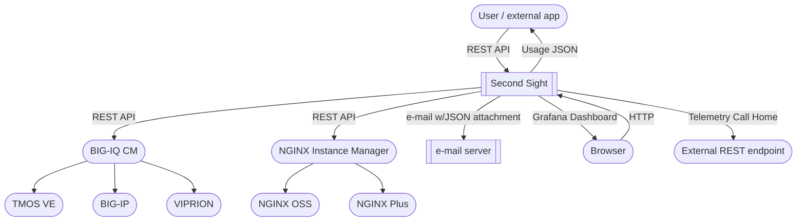
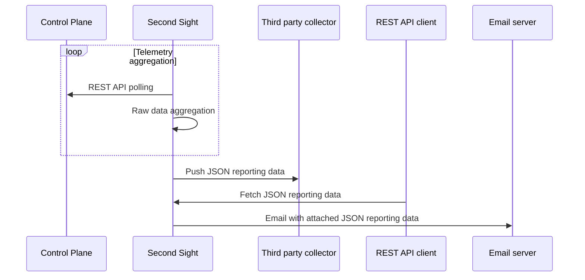
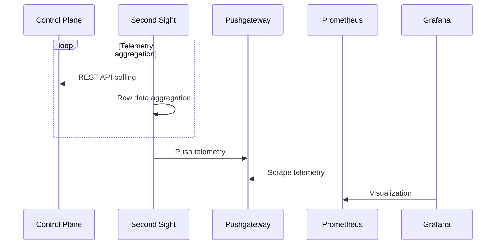

# Second Sight

## Description and features

Second Sight is a comprehensive tool that helps tracking NGINX OSS and NGINX Plus instances managed by NGINX Instance Manager/NGINX Management Suite and TMOS (BIG-IP, VIPRION, BIG-IP Virtual Edition) instances managed by BIG-IQ.
Raw data is collected from NGINX Instance Manager/NGINX Management Suite and BIG-IQ, aggregated and several JSON reports and visualizations are made available focusing on:

- Software usage
- Hardware usage
- Operating system and software releases
- Realtime CVE tracking
- Telemetry data (CPU, RAM, disk, network throughput, ...)

Second Sight has been tested against:

- NGINX Instance Manager/NGINX Management Suite 2.1.0+
- BIG-IQ 8.1.0, 8.1.0.2, 8.2.0

Communication to NGINX Instance Manager / BIG-IQ is based on REST API, current features are:

- REST API and high level reporting - see [usage page](/USAGE.md)
- JSON Telemetry mode
  - POSTs instance statistics to a user-defined HTTP(S) URL (STATS_PUSH_MODE: CUSTOM)
  - Basic authentication support
  - Configurable push interval (in seconds)
- Grafana visualization mode
  - Pushes instance statistics to pushgateway (STATS_PUSH_MODE: PUSHGATEWAY)
- Automated e-mail reporting
  - Sends an email containing the report JSON file as an attachment named nginx_report.json for NGINX Instance Manager, and bigip_report.json for BIG-IQ
  - Support for plaintext SMTP, STARTTLS, SMTP over TLS, SMTP authentication, custom SMTP port
  - Configurable push interval (in days)
- HTTP(S) proxy support
- Realtime CVE tracking
- Resource and applications telemetry (currently supported for BIG-IQ)

## Reporting and visualization

For additional dashboards see the [grafana page](/contrib/grafana)

BIG-IQ analytics


NGINX Instance Manager analytics


## Architecture

High level



JSON telemetry mode



Grafana visualization mode



## Prerequisites

- Kubernetes/Openshift cluster or Linux host with Docker support
- Private registry to push the Second Sight image if running on Kubernetes/Openshift
- One of:
  - NGINX Instance Manager 2.1.0+
    - Note: NGINX Instance Manager enforces rate limiting on `/api` by default. This needs to be disabled for Second Sight to operate correctly. To do this edit `/etc/nginx/conf.d/nms-http.conf` on NGINX Instance Manager and comment out the following lines in the `location /api` context:
	```
		limit_req zone=nms-ratelimit burst=10 nodelay;
		limit_req_status 429;
	```
	Then reload NGINX configuration using `nginx -s reload`
  - BIG-IQ 8.1.0, 8.1.0.2, 8.2.0
- SMTP server if automated email reporting is used
- NIST NVD REST API Key for full CVE tracking (https://nvd.nist.gov/developers/request-an-api-key)

# How to run

## On Docker Compose

This is the recommended method to run Second Sight on a Linux virtual machine.
Refer to [installation instructions](/contrib/docker-compose)

## As a native python application

Second Sight requires:

- Any Linux distribution
- Python 3 (tested on 3.9+)
- [FastAPI](https://fastapi.tiangolo.com/)
- [Uvicorn](https://www.uvicorn.org/)
- [Requests](https://docs.python-requests.org/en/master/)
- [json2html](https://pypi.org/project/json2html/)
- [clickhouse-driver](https://pypi.org/project/clickhouse-driver/)

Dependencies can be installed using:

```
$ cd f5tt
$ pip install -r requirements.txt
```

`f5tt/f5tt.sh` is a sample script to run Second Sight from bash

## On Kubernetes/Openshift

Second Sight image is available on Docker Hub as:

```
fiorucci/f5-telemetry-tracker:latest
```

File `1.f5tt.yaml` references such image by default.

If you need to build and push the docker image to a private registry:

```
git clone https://github.com/F5Networks/SecondSight
cd SecondSight/f5tt

docker build --no-cache -t PRIVATE_REGISTRY:PORT/f5-telemetry-tracker:latest .
docker push PRIVATE_REGISTRY:PORT/f5-telemetry-tracker:latest
```

Deploy on Kubernetes/Openshift:

```
cd SecondSight/manifests
```

Edit `1.f5tt.yaml` to customize:

- image name:
  - To be set to your private registry image (only if not using the image available on Docker Hub)
- environment variables:

| Variable  | Description |
| ------------- |-------------|
| F5TT_ADDRESS | optional IP address Second Sight should listen on. Default is 0.0.0.0 |
| F5TT_PORT| optional TCP port Second Sight should listen on. Default is 5000 |
| HTTP_PROXY| to be set if HTTP proxy must be used to connect to NGINX Instance Manager or BIG-IQ |
| HTTPS_PROXY| to be set if HTTPS proxy must be used to connect to NGINX Instance Manager or BIG-IQ |
| NIST_API_KEY| API Key for full NIST NVD CVE tracking (get your key at https://nvd.nist.gov/developers/request-an-api-key) |
| DATAPLANE_TYPE| can be NGINX_MANAGEMENT_SYSTEM (NIM 2.x) or BIG_IQ |
| DATAPLANE_FQDN| the FQDN of your NGINX Instance Manager 2.x / BIG-IQ instance| format must be http[s]://FQDN:port |
| DATAPLANE_USERNAME| the username for authentication |
| DATAPLANE_PASSWORD| the password for authentication |
| NMS_CH_HOST | if DATAPLANE_TYPE=NGINX_MANAGEMENT_SYSTEM (NGINX Instance Manager 2.1.0+) - ClickHouse IP address (optional, default: 127.0.0.1) |
| NMS_CH_PORT | if DATAPLANE_TYPE=NGINX_MANAGEMENT_SYSTEM (NGINX Instance Manager 2.1.0+) - ClickHouse TCP port (optional, default: 9000) |
| NMS_CH_USER | if DATAPLANE_TYPE=NGINX_MANAGEMENT_SYSTEM (NGINX Instance Manager 2.1.0+) - ClickHouse username (optional, default: 'default') |
| NMS_CH_PASS | if DATAPLANE_TYPE=NGINX_MANAGEMENT_SYSTEM (NGINX Instance Manager 2.1.0+) - ClickHouse password (optional, default: no password) |
| NMS_SAMPLE_INTERVAL | if DATAPLANE_TYPE=NGINX_MANAGEMENT_SYSTEM instances sample interval in seconds (optional, default: 60) |
| STATS_PUSH_ENABLE | if set to "true" push mode is enabled, disabled if set to "false" |
| STATS_PUSH_MODE | either CUSTOM or PUSHGATEWAY, to push (HTTP POST) JSON to custom URL and to push metrics to pushgateway, respectively |
| STATS_PUSH_URL | the URL where to push statistics |
| STATS_PUSH_INTERVAL | the interval in seconds between two consecutive push |
| STATS_PUSH_USERNAME | (optional) the username for POST Basic Authentication |
| STATS_PUSH_PASSWORD | (optional) the password for POST Basic Authentication |
| EMAIL_ENABLED | if set to "true" automated email reporting is enabled, disabled if set to "false" |
| EMAIL_INTERVAL| the interval in days between two consecutive email reports |
| EMAIL_SERVER | the FQDN of the SMTP server to use |
| EMAIL_SERVER_PORT| the SMTP server port |
| EMAIL_SERVER_TYPE| either "plaintext", "starttls" or "ssl" |
| EMAIL_AUTH_USER| optional, the username for SMTP authentication |
| EMAIL_AUTH_PASS| optional, the password for SMTP authentication |
| EMAIL_SENDER| the sender email address |
| EMAIL_RECIPIENT| the recipient email address |

- Ingress host:
  - By default it is set to `f5tt.ff.lan`

For standalone operations (ie. REST API + optional push to custom URL):

```
kubectl apply -f 0.ns.yaml
kubectl apply -f 1.f5tt.yaml
```

To push statistics to pushgateway also apply:

```
kubectl apply -f 2.prometheus.yaml
kubectl apply -f 3.grafana.yaml
kubectl apply -f 4.pushgateway.yaml
```

By default `2.prometheus.yaml` is configured for push mode, it must be edited decommenting the relevant section for pull mode

To setup visualization:

- Grafana shall be configured with a Prometheus datasource using by default http://prometheus.f5tt.ff.lan
- Import the [sample dashboards](/contrib/grafana) in Grafana

Service names created by default as Ingress resources are:

- `f5tt.ff.lan` - REST API and Prometheus scraping endpoint
- `pushgateway.f5tt.ff.lan` - Pushgateway web GUI
- `prometheus.f5tt.ff.lan` - Prometheus web GUI
- `grafana.f5tt.ff.lan` - Grafana visualization web GUI

## Additional tools

Additional tools can be found [here](/contrib)

- [BIG-IQ Collector](/contrib/bigiq-collect) - Offline BIG-IQ inventory processing
- [F5TT on BIG-IQ Docker](/contrib/bigiq-docker) - Run F5TT onboard BIG-IQ CM virtual machine
- [Grafana](/contrib/grafana) - Sample Grafana dashboards
- [Postman](/contrib/postman) - Sample Postman collection to test and run F5TT
- [Docker compose](/contrib/docker-compose) - Run F5TT on docker-compose
- [Kubernetes](/contrib/kubernetes) - Run F5TT on kubernetes to track NGINX usage based on NGINX Instance Manager
- [Second Sight GUI (beta)] - Web-based GUI for analytics and reporting

## F5 Support solutions

See F5 Support solutions:

- K83394355: How to count the number of NGINX instances with Second Sight on NGINX Instance Manager - https://support.f5.com/csp/article/K83394355
- K29144504: How to install and use (Offline) Second Sight collection Script on BIG-IQ - https://support.f5.com/csp/article/K29144504
- K94129313: How to install and use Docker Second Sight collection script - https://support.f5.com/csp/article/K94129313

# Usage

See the [usage page](/USAGE.md)
